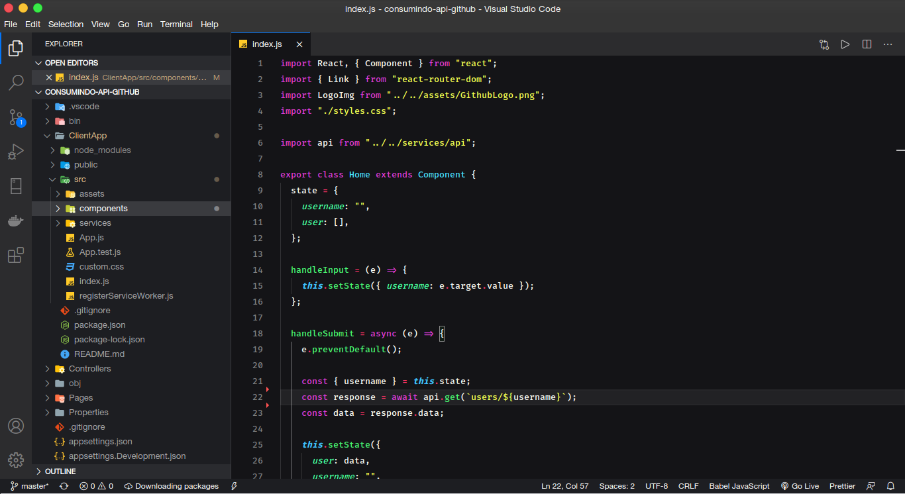
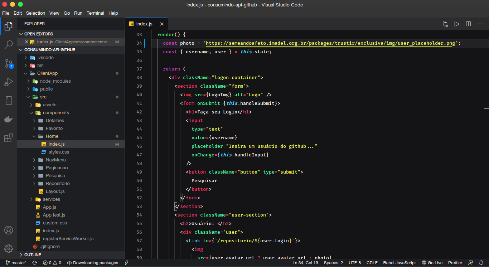

# A simple color sheme for VS CODE 
(based on Lukin Theme)

## 🎨 Mojave Theme for VS Code

  

<h1 align="center">
  Mojave Theme for VS Code
</h1>

  A minimal, dark and vibrant theme for VS Code (based on Lukin theme).

## Installation via VS Code

1. Open **Extensions** sidebar panel in VS Code. `View → Extensions`
2. Search for `Mojave Theme`
3. Click **Install** to install it
4. Click **Reload** to reload the editor
5. Code > Preferences > Color Theme > **Mojave Theme**

## License

[MIT](./license.md)